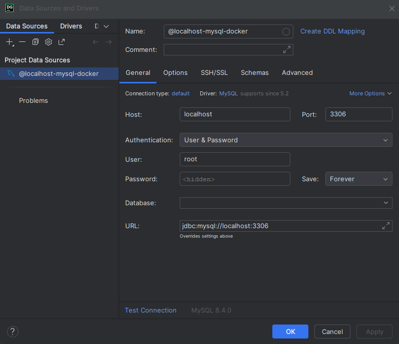
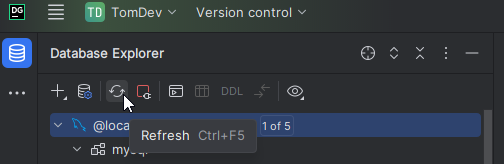
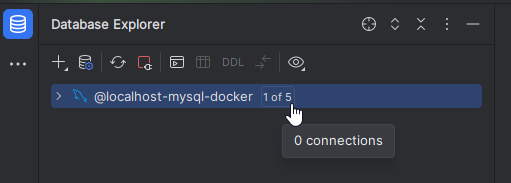
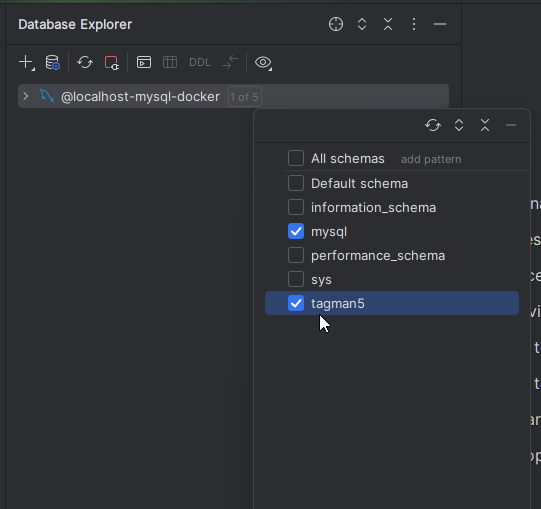
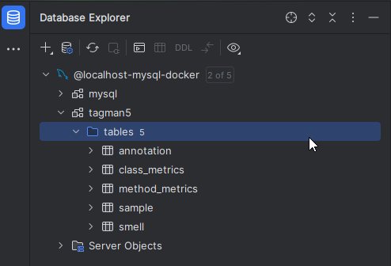


## Requirements:
- .NET 8.0 SDK
    - https://dotnet.microsoft.com/en-us/download/dotnet/8.0
- 7zip
    - https://www.7-zip.org/
- Docker
    - https://www.docker.com/products/docker-desktop/
- VSCode
    - https://code.visualstudio.com/download
- VS Code Extension: Polyglot Notebooks
- DACOS Dataset:
    - https://zenodo.org/records/7570428
        - You need `DACOSMain.sql` to create the database
        - You need `files.zip` for the actual codefile data

      *both of these files are provided in this code solution as 7zip archives*

### Setup Instructions
1. Download and install docker if you haven't already
2. Start docker:

   ```sudo systemctl start docker``` or ```dockerd``` or start docker desktop manually.

3. Pull latest mysql image:

   ```
   docker pull mysql:latest
   ```

4. Create and run a mysql container with the mysql version image you just pulled:

   ```
   docker run --name local-mysql -e MYSQL_ROOT_PASSWORD=password123 -p 3306:3306 -d mysql:latest
   ```
   Note the password you used for this command.

5. Connect to the database using your preferred sql IDE (I use datagrip):

   

6. Run the `./Resources/DACOS/MysqlDbScripts/DACOSMain.sql` script:
   **NOTE:** *This 7zip archive can be found in this README's directory.*

   Right-click your MySql connection and go to `Sql Scripts` -> `Run SQL Script...`

   

   Choose the file, and it will create the database with your data.

7. Refresh:

   

8. Click the `0 of 5` label in the Database Explorer:

   

9. Select the `tagman5` database to be included in your Database Explorer window:

   

10. You now have access to your labeled codesmell data!

    

# Additional Data Manipulation

## Exporting DACOSMain `tagman5` db table data to csv format

In order to be able to access the dataset data without needing overhead of a hosted mysql database, I opted to export all DACOSMain.sql table data into CSV files.

This gave me these five files:

1. `annotation.csv`
2. `class_metrics.csv`
3. `method_metrics.csv`
4. `sample.csv`
5. `smell.csv`

which have been stored in a single `.7z` compressed archive found in `./Resources/DACOS/DACOSTableDataAsCsvs/DACOSMainAsCsvs.7z` ([link](../DACOSTableDataAsCsvs)).

I have also opted to migrate these files into their own table into a DuckDB instance.
- See [this notebook](../../../Notebooks/1_Migrate_Csv_Data_To_DuckDb.dib) for instructions on how to do it